# Build an ETL Pipeline using SSIS

This project provides a comprehensive guide for building an ETL (Extract, Transform, Load) pipeline using SQL Server Integration Services (SSIS) in **Visual Studio 2019**.

---

## 🎯 Goal

The primary goal of this project is to provide a basic yet practical solution for anyone looking to build a new ETL pipeline using SSIS, with **AdventureWorks 2019** as the sample data source.

---

## ✅ Prerequisites

Make sure the following components are installed and properly configured:

- **Visual Studio 2019**  
  *Note: Visual Studio 2017 is also supported, but SSIS integration may behave differently.*

- **SQL Server Integration Services (SSIS) Extension for VS 2019**  
  👉 [Install SSIS for Visual Studio 2019](https://www.mssqltips.com/sqlservertip/6481/install-sql-server-integration-services-in-visual-studio-2019/)

- **SQL Server** (any supported edition)

- **SQL Server Management Studio (SSMS)**

- **AdventureWorks 2019 Sample Database**  
  📦 [Download AdventureWorks2019.bak](https://github.com/Microsoft/sql-server-samples/releases/download/adventureworks/AdventureWorks2019.bak)

---

## 🧭 Project Overview

The dataset simulates a sample retail system for a bicycle company. The objective is to build an end-to-end ETL pipeline to generate a variety of reports:

- Sales reports by employee
- Sales reports by region
- Number of orders per employee
- Number of orders per region
- Sales by product subcategory
- Sales by product and region

<i>ETL Architecture Overview</i>  

---

## 🛠️ First-time ETL

Build the staging area, design the data warehouse, and create SSIS packages to perform initial extraction, transformation, and loading of data.

<i>ETL Process - First Run</i>  
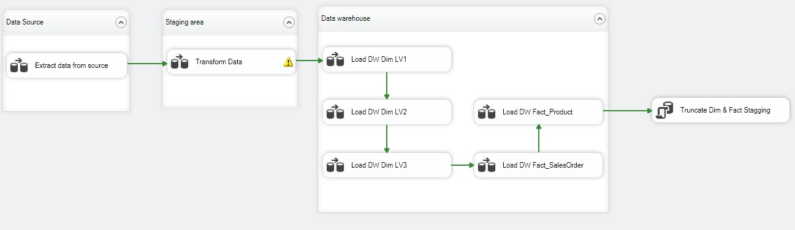

### Steps:

1. [Import source data into SSMS](https://learn.microsoft.com/en-us/sql/samples/adventureworks-install-configure?view=sql-server-ver16&tabs=ssms#tabpanel_1_ssms)
2. Design a data warehouse schema to support reporting  
   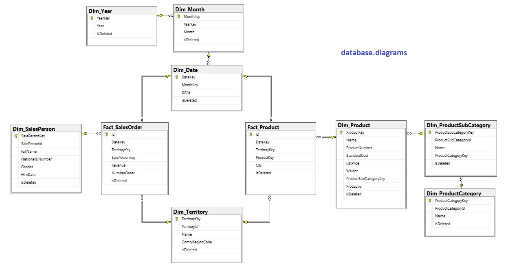
3. Create the data warehouse  
   [`AVW_datawarehouse_createDatabase.sql`](./Scripts/AVW_datawarehouse_createDatabase.sql)
4. Create the staging database  
   [`AVW_staging_createDatabase.sql`](./Scripts/AVW_staging_createDatabase.sql)
5. Extract data into the staging area  
   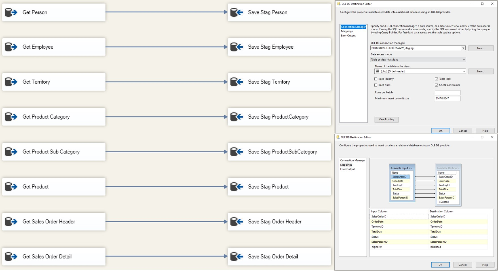
6. Transform source data into dimensions and facts  
   
7. Load dimension tables (Level 1)  
   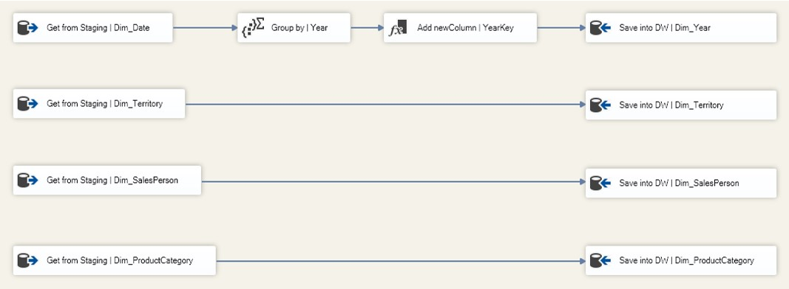
8. Load dimension tables (Level 2)  
   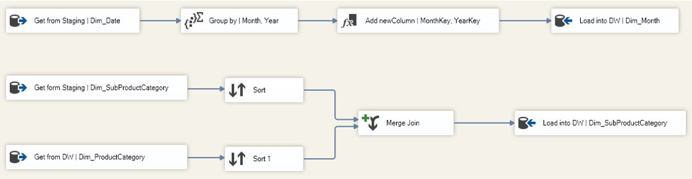
9. Load dimension tables (Level 3)  
   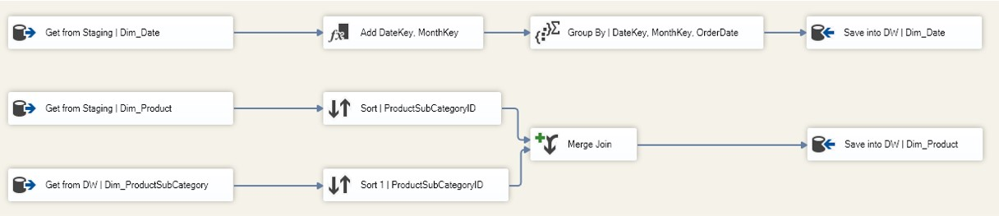
10. Load SalesOrder fact table  
    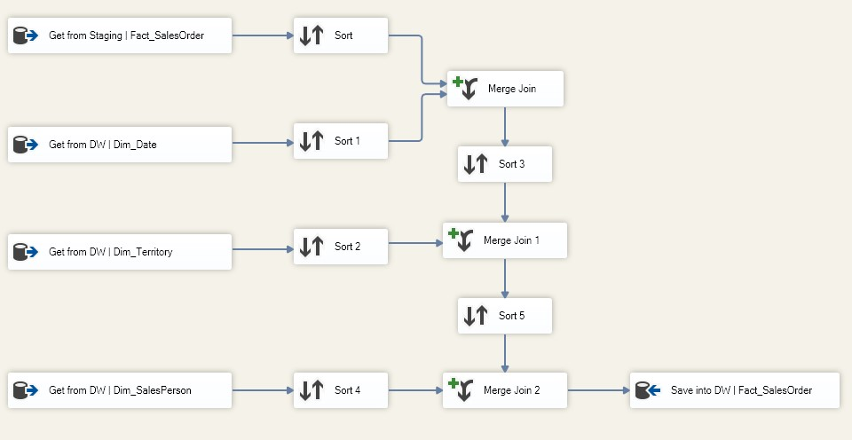
11. Load Product fact table  
    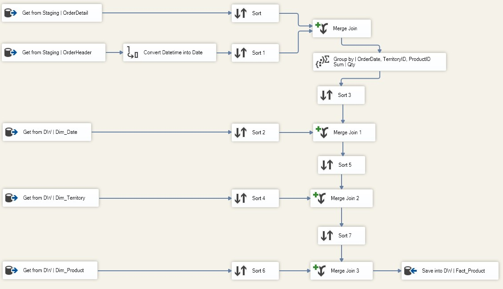
12. Truncate all dimension and fact tables in the staging area to prepare for future ETL runs  
    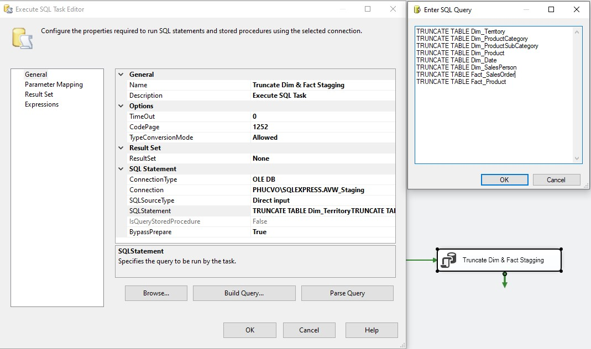

---

## 🔁 Next-time ETL

Incrementally extract **only the new, updated, or deleted** records from the source and process them.

### 💡 Solution Strategy

- **New & Updated Records:**  
  Use `Slowly Changing Dimension (SCD)` and `Lookup Transformation` to compare incoming data with existing staging data.  
  - [SCD + Lookup + Conditional Split](https://sqlgiant.wordpress.com/2012/03/18/slowly-changing-dimension-type-1-with-lookup-and-conditional-split/)
  - [Update SCD without OLE DB Command](https://sqlgiant.wordpress.com/2012/03/21/an-alternative-to-the-ole-db-command-to-update-slowly-changing-dimensions/)

- **Deleted Records:**  
  Mark records as deleted by using an `IsDeleted` column. Set it to `1` before loading, and back to `0` if matched with source data. Remaining `1` values indicate deletions.

<i>Next-time ETL Architecture</i>  
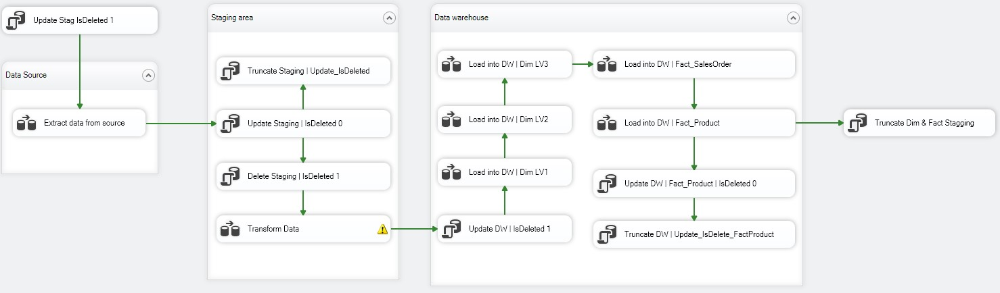

---

### 🔨 Next-time ETL Tasks

1. Set `IsDeleted = 1` in staging for all records before extraction  
   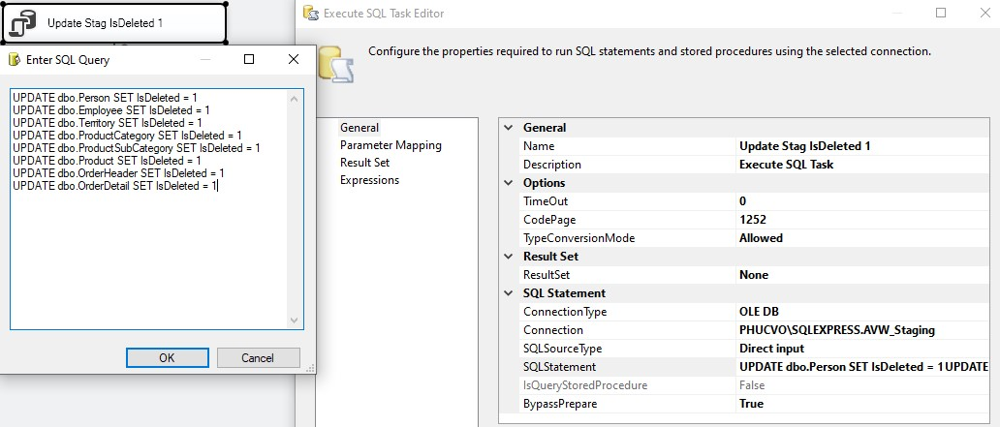
2. Extract new/updated/deleted records using:
   - `SCD` for small datasets  
     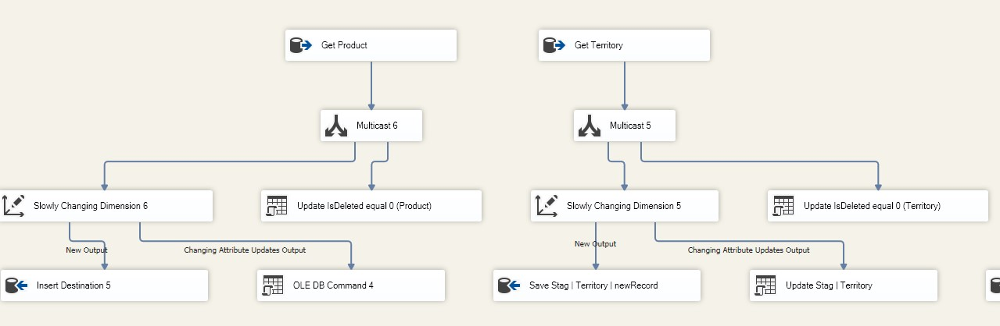
   - `Lookup Transformation` for large datasets  
     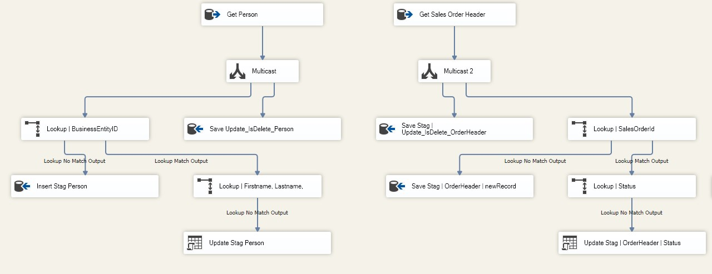
3. Use `Execute SQL Task` to:
   - Set `IsDeleted = 0` for matched IDs
   - Truncate `Update_IsDelete_nameTable` after update  
     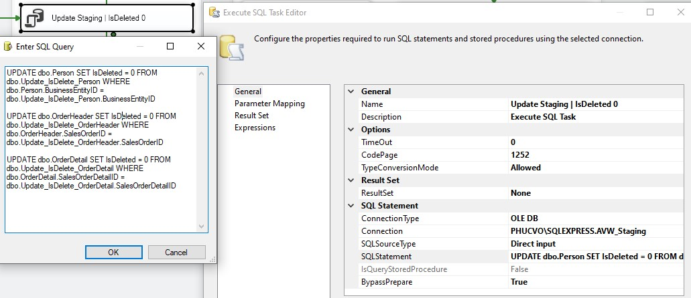
4. Delete records in staging with `IsDeleted = 1`  
   
5. Transform staging data into dimension and fact formats  
   
6. Update `IsDeleted = 1` in DW for records not matched  
   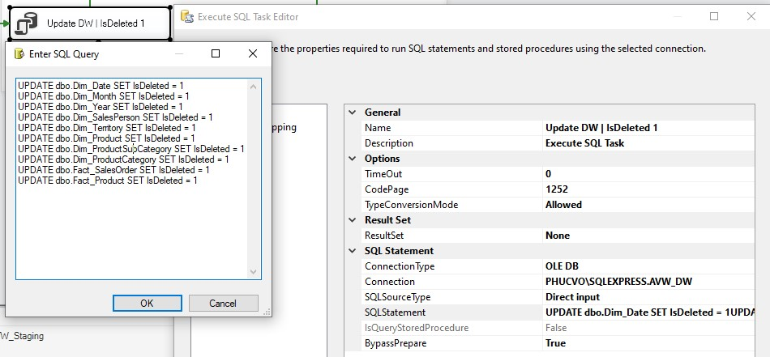
7. Load changes to DW using `SCD` and `Lookup`, but apply only **soft deletes** (do not delete rows)
   - Load Dimension Level 1  
     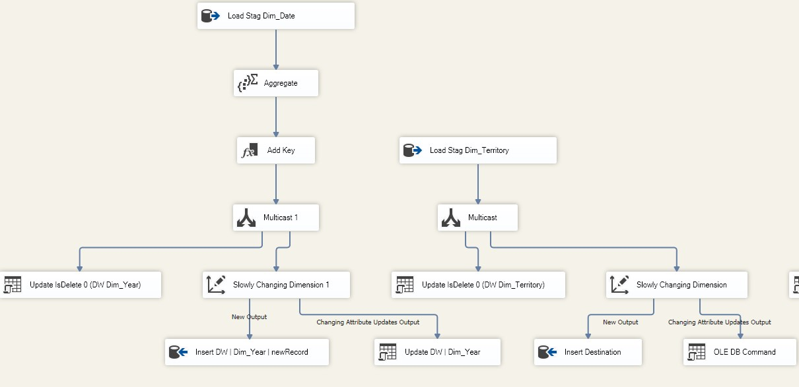
   - Load Dimension Level 2  
     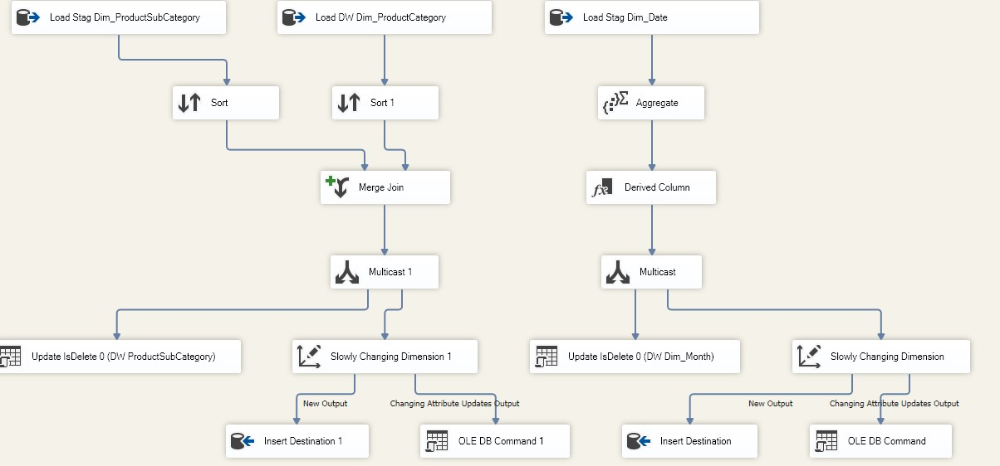
   - Load Dimension Level 3  
     
   - Load SalesOrder Facts  
     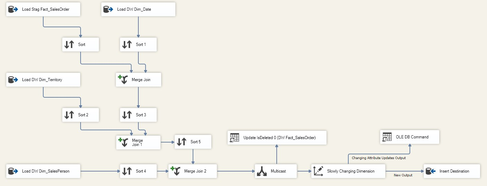
   - Load Product Facts  
     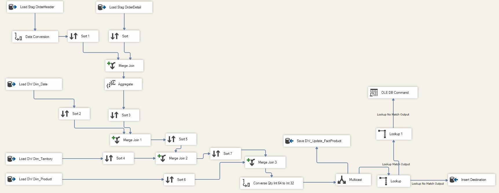
   - Update `IsDeleted = 0` and truncate helper table  
     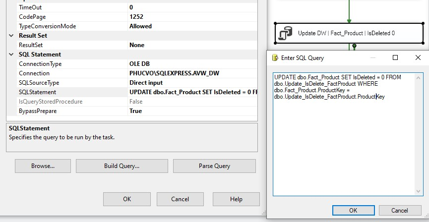
8. Truncate all staging dimension/fact tables again to prepare for next cycle

---

## 📁 Package Location

All SSIS packages are available in the `/Package-SSIS` directory.

---

## 📬 Need Help?

If you have any questions or encounter any issues while implementing the ETL flow, feel free to reach out via email.

Thank you for your interest and happy building!
